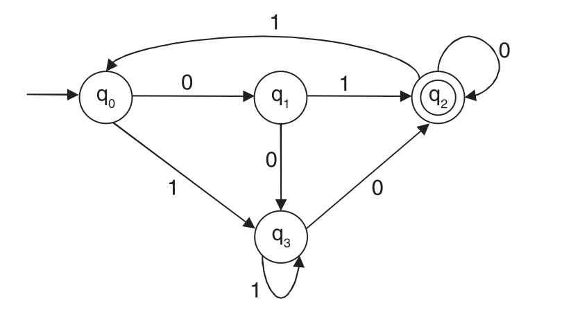
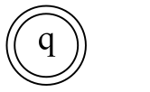

# Lab (3) Notes
Ahmed Al-Qassas [qassas.ahmed@mau.edu.eg](qassas.ahmed@mau.edu.eg)  
Spring 2023-24
----
# 0. Review on Lab (2)
Chomsky structured a hierarchy of formal languages based on the properties of the grammar required to generate the languages.

| Grammar  | Language                   | Machine Format          |
|:---------|:---------------------------|:------------------------|
| _Type 0_ | Unrestricted Language      | Turing Machine          |
| _Type 1_ | Context-sensitive language | Linear bounded automata |
| _Type 2_ | Context-free language      | Push down automata      |
| _Type 3_ | Regular Expression         | Finite automata (FSM)   |

# 1. Use of Automata
The main usefulness is in **lexical analyser** and syntax error. **But what is lexical analyser**?  
Lexical Analysis is the first phase of the compiler also known as a scanner. It converts the High level input program into a sequence of _Tokens_.
[Read this article](https://www.geeksforgeeks.org/introduction-of-lexical-analysis/) for more information.   
## Example on Lexical Analyser:
```C
// This is a loop
while(a >= b){
    a = a - 2;
}
```

| Lexemes | Tokens     | Lexemes  | TOKENS      |
|:--------|:-----------|:---------|:------------|
| while   | WHILE      | a        | IDENTIFIER  |
| (       | LAPREN     | =        | ASSIGNMENT  |
| a       | IDENTIFIER | a        | IDENTIFIER  |
| >=      | COMPARISON | –        | ARITHMETIC  |
| b       | IDENTIFIER | 2        | INTEGER     |
| )       | RPREN      | ;        | SEMICOLON   |


# 2. Finite Automata
It is called finite because it has a **finite number of states**. The _state_ of the system memorizes the information concerning the past input. It is necessary to determine the future behaviour of the system.

A finite automata is defined by a five tuple:  
M = {Q, Σ, δ, q<sub>0</sub>, F}
* **Q**: Finite non-empty set of states.
* **Σ**: Finite non-empty set of input symbols.
* **δ**: Transitional function.
* **q<sub>0</sub>**: Beginning state.
* **F**: Finite non-empty set of final states.

# 3. FA Types: DFA and NFA
A string is declared accepted by an FA if the string is finished and the machine has reached a final.
state.
## DFA  
DFA is a finite automata where, for all cases, when a single input is given to a single state, the  **machine goes to a single state**, i.e., all the moves of the machine can be uniquely determined by the present state and the present input symbol.

## NFA 
Non-deterministic finite automata  NFA is a finite automaton where, for some cases, when a single input is given to a single state, **the machine goes to more than one states**, i.e., some of  the moves of the machine cannot be uniquely determined by the present state and the present input symbol.

# 4. Examples
## Example 1: check whether the stings accepted by the given FA, and determine whether it is an DFA or NFA.
* string 1: `0111100`
* string 2: `11111`
* string 3: `11010`  

  

----
###### Notes
# _The symbol   refers to the start (initial) state while final state is represented by _  .

----
###### Solution 
string 1: `0111100`

| δ | Q  |           Σ |
|:--|:---|------------:|
| 1 | q0 | **0**111100 |
| 2 | q1 |  **1**11100 |
| 3 | q2 |   **1**1100 |
| 4 | q1 |    **1**100 |
| 5 | q3 |     **1**00 |
| 6 | q3 |      **0**0 |
| 7 | q2 |       **0** |
| 8 | q2 |           - |

Since the string is completely eliminated, and we have reached a final state (q2). **the string `0111100` is accepted** ✅.  

string 2: `1111`   
This string will **not** be accepted. Since the last symbol is `1` and clearly this FA accepts only strings ending with `0`. Let's do it step by step.

| δ | Q  |        Σ |
|:--|:---|---------:|
| 1 | q0 | **1**111 |
| 2 | q3 |  **1**11 |
| 3 | q3 |   **1**1 |
| 4 | q3 |    **1** |
| 5 | q3 |        - |

Since the string is completely eliminated at `q3` which is not a final state. The string `1111` will be rejected ❌. Actually, any string ending with `1` will be rejected.

string: `11010`  

| δ | Q  |         Σ |
|:--|:---|----------:|
| 1 | q0 | **1**1010 |
| 2 | q3 |  **1**010 |
| 3 | q3 |   **0**10 |
| 4 | q2 |    **1**0 |
| 5 | q0 |     **0** |
| 6 | q1 |         - |  

Easy. `11010` is rejected ❌.
## Example 2
Construct a DFA from the given NFA.

| Q     | 0      | 1  |
|-------|--------|----|
| -> q0 | q0, q1 | q2 |
| q1    | q2     | q1 |
| (q2)  | q1     | q2 |

|    | Q*         | 0          | 1       |
|---:|------------|------------|---------|
|  A | [q0]       | [q0 q1]    | [q2]    |
|  B | [q0 q1]    | [q0 q1 q2] | [q1 q2] |
|  C | [q1 q2]    | [q1 q2]    | [q1 q2] |
|  D | [q0 q1 q2] | [q0 q1 q2] | [q1 q2] |
|  E | [q2]       | [q1]       | [q2]    |
|  F | [q1]       | [q2]       | [q1]    |

| Q* | 0 | 1 |
|----|---|---|
| A  | B | E |
| B  | D | C |
| C  | C | C |
| D  | D | C |
| E  | F | E |
| F  | E | F |


